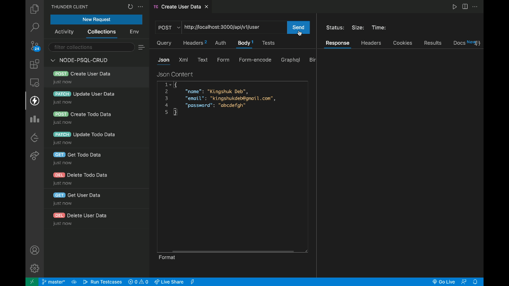
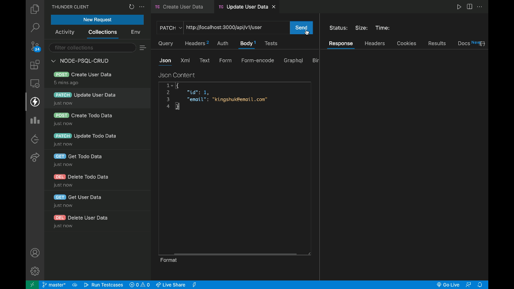
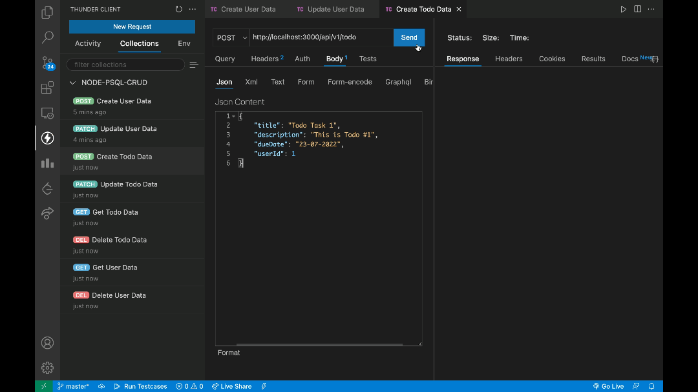
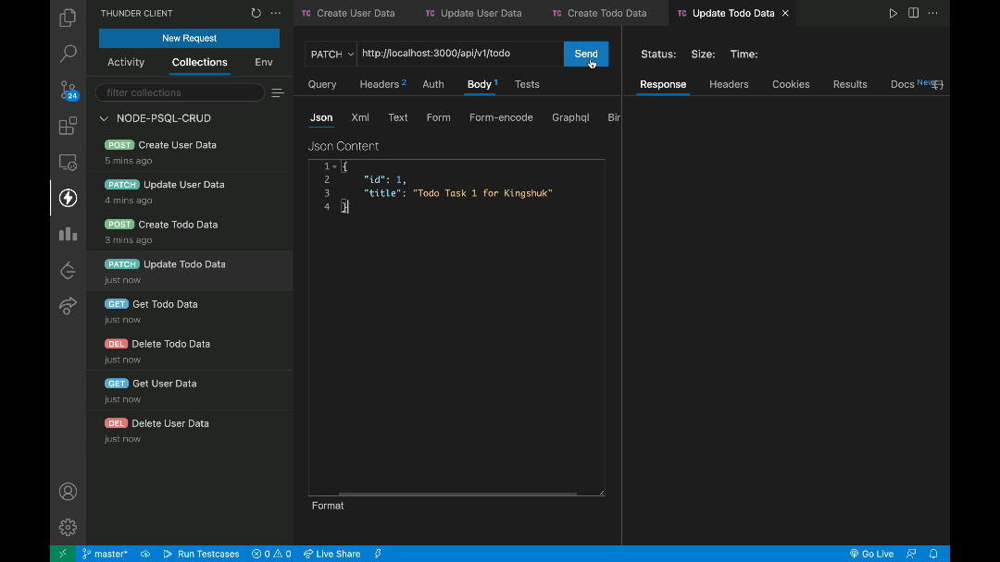
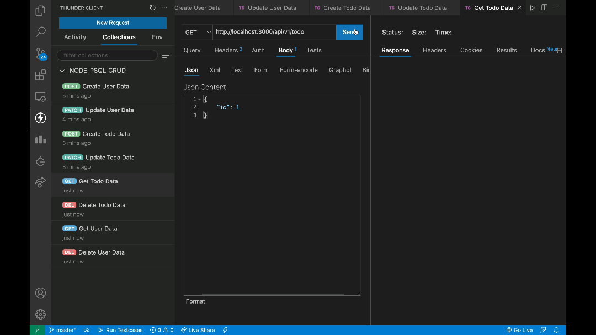
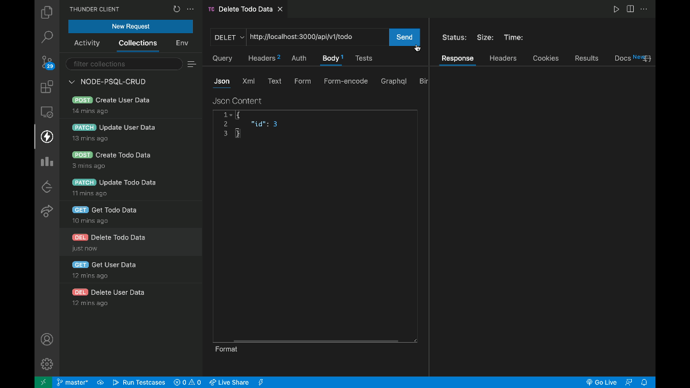
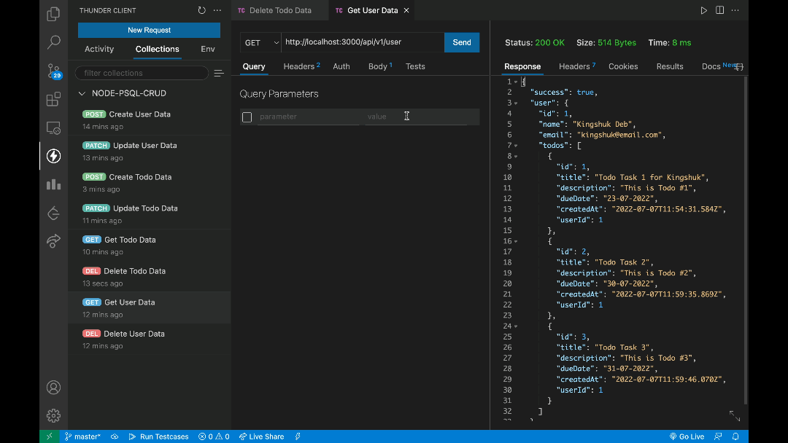
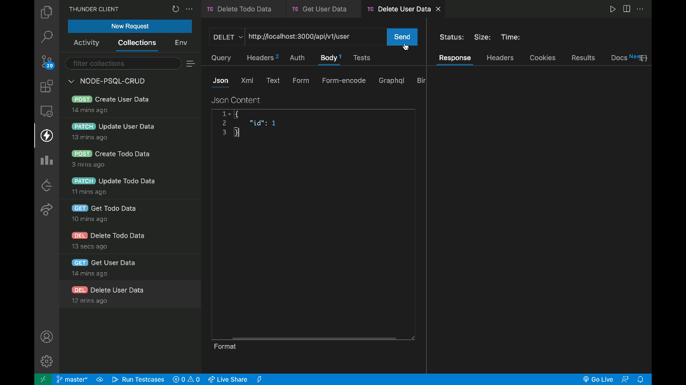

# Node-PSQL-Todo-BackEnd

# Tech Stack
- Node.js
- PostGreSQL
- Prisma ORM
- Typescript

# How to Run:

- Run Postgres Instance on Prisma
```bash
npx prisma migrate dev
npx prisma studio
```
- Start Server
```bash
npm run dev
```

# Query Examples :

- `POST: http://localhost:3000/api/v1/client/` -> Create User Data



- `PUT: http://localhost:3000/api/v1/client/` -> Update User Data



- `POST: http://localhost:3000/api/v1/client/job` -> Create Todo Data



- `PUT: http://localhost:3000/api/v1/client/job` -> Update Todo Data



- `GET: http://localhost:3000/api/v1/client/` -> Get Todo Data



- `GET: http://localhost:3000/api/v1/client/` -> Delete Todo Data



- `GET: http://localhost:3000/api/v1/client/` -> Get User Data



- `GET: http://localhost:3000/api/v1/client/` -> Delete User Data


